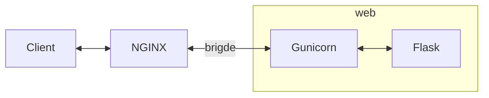

# DEEP LEARNING ON FLASK <!-- omit in toc -->

This repository stores a test to demonstrate skills mainly with [Python], [Keras], [Flask], [Docker], [Jupyter Notebook], [microservices] and [REST API].

- [PURPOSE](#purpose)
- [DEPENDENCIES](#dependencies)
  - [PYTHON VIRTUAL ENVIRONMENT](#python-virtual-environment)
- [REPOSITORY CONTENT](#repository-content)
- [ARCHITECTURE](#architecture)
- [DEEP LEARNING MODEL](#deep-learning-model)
- [HOW TO RUN DEEP LEARNING ON FLASK WITH DOCKER COMPOSE](#how-to-run-deep-learning-on-flask-with-docker-compose)
- [TEST SERVER & REST API](#test-server--rest-api)
- [CREDITS](#credits)

## PURPOSE

The goal is to deploy on [Flask] a [deep learning] model as a microservice. The model is used to predict handwritten digits and it has been previously trained on a [Jupyter Notebook]. [REST API] are utilized to communicate with the deployed model. e.g. send image to be analized and return the generated predictions to the client.

## DEPENDENCIES

The code has been tested using:

* [Python] (3.10): an interpreted high-level programming language for general-purpose programming.
* [Jupyter Lab] (3.4): a web-based interactive development environment for [Jupyter Notebooks], code and data.
* [Flask] (2.2): a microframework for [Python] based on Werkzeug, Jinja 2 and good intentions.
* [Gunicorn] (20.1.0): a [Python] [WSGI] HTTP Server for UNIX.
* [NGINX] (1.23): a free, open-source, high-performance HTTP server, reverse proxy, and IMAP/POP3 proxy server.
* [Docker] (19.03.13-ce): an open platform for developers and sysadmins to build, ship, and run distributed applications, whether on laptops, data center VMs, or the cloud.
* [Docker-Compose] (1.29.2): a tool for defining and running multi-container [Docker] applications.
* [Keras] ([TensorFlow] built-in): a high-level neural networks [API], written in [Python] and capable of running on top of [TensorFlow].
* [TensorFlow] (2.10): an open source software [Deep Learning] library for high performance numerical computation using data flow graphs.
* [Matplotlib] (3.6): a plotting library for [Python] and its numerical mathematics extension [NumPy].
* [NumPy] (1.23): a library for [Python], adding support for large, multi-dimensional arrays and matrices, along with a large collection of high-level mathematical functions to operate on these arrays.
* [scikit-image] (0.19): a collection of algorithms for image processing with [Python].

### PYTHON VIRTUAL ENVIRONMENT

Virtual environment (<env_name>=**dlflask3**) can be generated from **requirements.txt** file located in the repository.


Command to configure virtual environment with [venv]:

```bash
~/deeplearning_flask$ python3 -m venv dlflask3
~/deeplearning_flask$ source dlflask3/bin/activate
(dlflask3)~/deeplearning_flask$ python3 -m pip install pip==22.2.2
(dlflask3)~/deeplearning_flask$ python3 -m pip install setuptools==65.4.0
(dlflask3)~/deeplearning_flask$ python3 -m pip install -r requirements.txt
```

## REPOSITORY CONTENT

The repository main folder contains:

```bash
deeplearning_flask
├── .env.example
├── app
│   ├── app
│   │   ├── __init__.py
│   │   ├── api.py
│   │   ├── model.py
│   │   ├── static
│   │   │   └── 4.jpg
│   │   └── templates
│   │       └── dlflask.html
│   ├── config.py
│   ├── Makefile
│   ├── mnist_model.h5
│   ├── server.py
│   └── tests
│       ├── __init__.py
│       ├── conftest.py
│       └── test_app.py
├── Deep Learning MNIST prediction model with Keras.ipynb
├── docker-compose.yml
├── Dockerfile
├── nginx
│   └── conf.d
│       └── local.conf
├── README.md
└── requirements.txt
```

## ARCHITECTURE

The architecture created with [docker-compose] uses two different [Docker] containers for:

* [NGINX].
* [Flask] and [Gunicorn].

The following diagram illustrates the architecture in blocks:



## DEEP LEARNING MODEL

The definition and training of the [deep learning] MNIST model was done through a notebook in [Jupyter Lab]. The employed notebook is stored in the main folder, to run it use the command shown below:

```bash
(dlflask3)~/deeplearning_flask$ jupyter lab Deep\ Learning\ MNIST\ prediction\ model\ with\ Keras.ipynb
```

## HOW TO RUN DEEP LEARNING ON FLASK WITH DOCKER COMPOSE

The steps and commands to run the [deep learning] model on the [Flask] server with [docker-compose] are described below.

Before executing [docker-compose] is strongly recommended to close other applications to free up resources and ports to avoid potential issues. Then [docker-compose] can be executed to build services.

```bash
~/deeplearning_flask$ docker-compose build
```

Next step consists in executing [docker-compose] up command.

```bash
~/deeplearning_flask$ docker-compose up
```

If everything goes fine at the end it should appear something similar to:

```bash
...
...
web_1    | 2020-06-04 19:30:17.818273: I tensorflow/compiler/xla/service/service.cc:176]   StreamExecutor device (0): Host, Default Version
```

## TEST SERVER & REST API

There are different ways to check that the server is running properly. One is opening a web browser such as Chrome or Firefox and paste the following URL:

```bash
http://127.0.0.1/
```

The web browser should show the text "Deep Learning on Flask".

[REST API] can be tested with [pytest] or [curl].

It is possible to execute tests of [Flask] microservice created with [pytest] from inside the [Flask] [Docker] container using [Makefile]:

```bash
~/deeplearning_flask$ docker exec -it deeplearning_flask_web_1 /bin/bash
~/app# make test
...
test_app.py ..                                                         [100%]
```

A POST example using [curl] from outside [Docker] container is shown below:

```bash
~/deeplearning_flask$ curl -F file=@app/app/static/4.jpg -X POST 'http://127.0.0.1/api/predictlabel' | json_pp
  % Total    % Received % Xferd  Average Speed   Time    Time     Time  Current
                                 Dload  Upload   Total   Spent    Left  Speed
100 11650  100   489  100 11161    321   7347  0:00:01  0:00:01 --:--:--  7664
{
  "most_probable_label": "4",
  "predictions": [
    {
      "label": "0",
      "probability": "8.025511e-09"
    },
    {
      "label": "1",
      "probability": "1.9455256e-05"
    },
    {
      "label": "2",
      "probability": "1.4459256e-05"
    },
    {
      "label": "3",
      "probability": "9.0475e-06"
    },
    {
      "label": "4",
      "probability": "0.9971827"
    },
    {
      "label": "5",
      "probability": "7.5980934e-06"
    },
    {
      "label": "6",
      "probability": "1.1683321e-06"
    },
    {
      "label": "7",
      "probability": "0.0018591178"
    },
    {
      "label": "8",
      "probability": "0.0005154088"
    },
    {
      "label": "9",
      "probability": "0.00039107347"
    }
  ],
  "success": true
}
```

## CREDITS

author: alvertogit
copyright: 2018-2022

[Python]: https://www.python.org/
[Flask]: https://flask.palletsprojects.com/en/1.1.x/
[Gunicorn]: https://gunicorn.org/
[WSGI]: https://en.wikipedia.org/wiki/Web_Server_Gateway_Interface
[NGINX]: https://www.nginx.com/
[Docker]: https://www.docker.com/
[microservices]: https://en.wikipedia.org/wiki/Microservices
[REST API]: https://en.wikipedia.org/wiki/Representational_state_transfer
[Docker-Compose]: https://github.com/docker/compose
[venv]: https://docs.python.org/3/library/venv.html
[Jupyter Lab]: https://jupyter.org/
[Jupyter Notebook]: https://jupyter.org/
[Jupyter Notebooks]: https://jupyter.org/
[Deep Learning]: https://en.wikipedia.org/wiki/Deep_learning
[Keras]: https://keras.io/
[TensorFlow]: https://www.tensorflow.org/
[Matplotlib]: https://matplotlib.org/
[NumPy]: https://numpy.org/
[scikit-image]: https://scikit-image.org/
[curl]: https://curl.haxx.se/
[pytest]: https://docs.pytest.org/en/latest/
[Makefile]: https://en.wikipedia.org/wiki/Makefile
