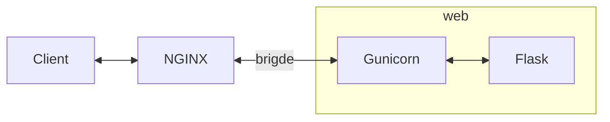

# DEEP LEARNING ON FLASK <!-- omit in toc -->

This repository stores a test to demonstrate skills mainly with [Python], [Keras], [Flask], [Docker], [Jupyter Notebook], [microservices], [REST API] and [GitHub Actions].

- [PURPOSE](#purpose)
- [DEPENDENCIES](#dependencies)
  - [PYTHON VIRTUAL ENVIRONMENT](#python-virtual-environment)
- [REPOSITORY CONTENT](#repository-content)
- [ARCHITECTURE](#architecture)
- [DEEP LEARNING MODEL](#deep-learning-model)
- [HOW TO RUN DEEP LEARNING ON FLASK WITH DOCKER COMPOSE](#how-to-run-deep-learning-on-flask-with-docker-compose)
- [TEST SERVER \& REST API](#test-server--rest-api)
- [CREDITS](#credits)

## PURPOSE

The goal is to deploy on [Flask] a [Deep Learning] model as a microservice. The model is used to predict handwritten digits and it has been previously trained on a [Jupyter Notebook]. [REST API] are utilized to communicate with the deployed model. e.g. send image to be analized and return the generated predictions to the client. [GitHub Actions] are employed to implement CI/CD workflows in the project.

## DEPENDENCIES

The code has been tested using:

- [Python] (3.12): an interpreted high-level programming language for general-purpose programming.
- [Jupyter Lab] (4.5): a web-based interactive development environment for [Jupyter Notebooks], code and data.
- [Flask] (3.1): a microframework for [Python] based on Werkzeug, Jinja 2 and good intentions.
- [Gunicorn] (23.0): a [Python] [WSGI] HTTP Server for UNIX.
- [NGINX] (1.29): a free, open-source, high-performance HTTP server, reverse proxy, and IMAP/POP3 proxy server.
- [Docker] (28.5): an open platform for developers and sysadmins to build, ship, and run distributed applications, whether on laptops, data center VMs, or the cloud.
- [Docker Compose] (2.40): a tool for defining and running multi-container [Docker] applications.
- [Keras] ([TensorFlow] built-in): a high-level neural networks API, written in [Python] and capable of running on top of [TensorFlow].
- [TensorFlow] (2.20): an open source software [Deep Learning] library for high performance numerical computation using data flow graphs.
- [Matplotlib] (3.10): a plotting library for [Python] and its numerical mathematics extension [NumPy].
- [NumPy] (2.4): a library for [Python], adding support for large, multi-dimensional arrays and matrices, along with a large collection of high-level mathematical functions to operate on these arrays.
- [Ruff] (0.14): An extremely fast Python linter and code formatter, written in Rust.
- [scikit-image] (0.26): a collection of algorithms for image processing with [Python].

### PYTHON VIRTUAL ENVIRONMENT

Virtual environment (<env_name>=**.venv**) can be generated from **requirements_dev.txt** file located in the repository.

Command to configure virtual environment with [venv]:

```bash
~/deeplearning_flask$ python3 -m venv .venv
~/deeplearning_flask$ source .venv/bin/activate
(.venv)~/deeplearning_flask$ python3 -m pip install pip==25.3
(.venv)~/deeplearning_flask$ python3 -m pip install setuptools==80.9.0
(.venv)~/deeplearning_flask$ python3 -m pip install -r requirements_dev.txt
(.venv)~/deeplearning_flask$ pre-commit install
```

## REPOSITORY CONTENT

The repository main folder contains:

```bash
deeplearning_flask
├── .env.example
├── .env.test
├── .github
│   └── workflows
│       └── ci_tests.yml
├── .gitignore
├── .pre-commit-config.yaml
├── app
│   ├── app
│   │   ├── __init__.py
│   │   ├── api.py
│   │   ├── model.py
│   │   ├── static
│   │   │   └── 4.jpg
│   │   └── templates
│   │       └── dlflask.html
│   ├── config.py
│   ├── Makefile
│   ├── mnist_model.keras
│   ├── server.py
│   └── tests
│       ├── __init__.py
│       ├── conftest.py
│       └── test_app.py
├── Deep Learning MNIST prediction model with Keras.ipynb
├── docker-compose.yml
├── Dockerfile
├── nginx
│   └── conf.d
│       └── local.conf
├── pyproject.toml
├── README.md
├── requirements.txt
└── requirements_dev.txt
```

## ARCHITECTURE

The architecture created with [Docker Compose] uses two different [Docker] containers for:

- [NGINX].
- [Flask] and [Gunicorn].

The following diagram illustrates the architecture in blocks:



## DEEP LEARNING MODEL

The definition and training of the [Deep Learning] MNIST model was done through a notebook in [Jupyter Lab]. The employed notebook is stored in the main folder, to run it use the command shown below:

```bash
(.venv)~/deeplearning_flask$ jupyter lab Deep\ Learning\ MNIST\ prediction\ model\ with\ Keras.ipynb
```

## HOW TO RUN DEEP LEARNING ON FLASK WITH DOCKER COMPOSE

The steps and commands to run the [Deep Learning] model on the [Flask] server with [Docker Compose] are described below.

Before executing [Docker Compose] is strongly recommended to close other applications to free up resources and ports to avoid potential issues. Then [Docker Compose] can be executed to build services.

```bash
~/deeplearning_flask$ docker compose build
```

Next step consists in executing [Docker Compose] up command.

```bash
~/deeplearning_flask$ docker compose up
```

If everything goes fine at the end it should appear something similar to:

```bash
...
...
web_1    | 2020-06-04 19:30:17.818273: I tensorflow/compiler/xla/service/service.cc:176]   StreamExecutor device (0): Host, Default Version
```

## TEST SERVER & REST API

There are different ways to check that the server is running properly. One is opening a web browser such as Chrome or Firefox and paste the following URL:

```bash
http://127.0.0.1/
```

The web browser should show the text "Deep Learning on Flask".

[REST API] can be tested with [pytest] or [curl].

It is possible to execute tests of [Flask] microservice created with [pytest] from inside the [Flask] [Docker] container using [Makefile]:

```bash
~/deeplearning_flask$ docker exec -it deeplearning_flask-web-1 /bin/bash
~/app# make test
...
============================= test session starts ==============================platform linux -- Python 3.12.12, pytest-9.0.2, pluggy-1.6.0
rootdir: /app/tests
collected 2 items

test_app.py ..                                                           [100%]
```

Those tests are also automatically executed with CI/CD workflows implemented with [GitHub Actions] for every push and pull request in the project repository.

A POST example using [curl] from outside [Docker] container is shown below:

```bash
~/deeplearning_flask$ curl -F file=@app/app/static/4.jpg -X POST 'http://127.0.0.1/api/predictlabel' | json_pp
  % Total    % Received % Xferd  Average Speed   Time    Time     Time  Current
                                 Dload  Upload   Total   Spent    Left  Speed
100 11650  100   489  100 11161    321   7347  0:00:01  0:00:01 --:--:--  7664
{
   "most_probable_label" : "4",
   "predictions" : [
      {
         "label" : "0",
         "probability" : "8.270098e-08"
      },
      {
         "label" : "1",
         "probability" : "0.00016669065"
      },
      {
         "label" : "2",
         "probability" : "4.821898e-05"
      },
      {
         "label" : "3",
         "probability" : "2.3290573e-05"
      },
      {
         "label" : "4",
         "probability" : "0.99914443"
      },
      {
         "label" : "5",
         "probability" : "1.4074722e-06"
      },
      {
         "label" : "6",
         "probability" : "2.4940262e-05"
      },
      {
         "label" : "7",
         "probability" : "0.0004908524"
      },
      {
         "label" : "8",
         "probability" : "4.4384862e-05"
      },
      {
         "label" : "9",
         "probability" : "5.569217e-05"
      }
   ],
   "success" : true
}
```

## CREDITS

author: alvertogit
copyright: 2018-2025

[Python]: https://www.python.org/
[Flask]: https://flask.palletsprojects.com/en/1.1.x/
[Gunicorn]: https://gunicorn.org/
[WSGI]: https://en.wikipedia.org/wiki/Web_Server_Gateway_Interface
[NGINX]: https://www.nginx.com/
[Docker]: https://www.docker.com/
[microservices]: https://en.wikipedia.org/wiki/Microservices
[REST API]: https://en.wikipedia.org/wiki/Representational_state_transfer
[GitHub Actions]: https://github.com/features/actions
[Docker Compose]: https://github.com/docker/compose
[venv]: https://docs.python.org/3/library/venv.html
[Jupyter Lab]: https://jupyter.org/
[Jupyter Notebook]: https://jupyter.org/
[Jupyter Notebooks]: https://jupyter.org/
[Deep Learning]: https://en.wikipedia.org/wiki/Deep_learning
[Keras]: https://keras.io/
[TensorFlow]: https://www.tensorflow.org/
[Matplotlib]: https://matplotlib.org/
[NumPy]: https://numpy.org/
[scikit-image]: https://scikit-image.org/
[curl]: https://curl.haxx.se/
[pytest]: https://docs.pytest.org/en/latest/
[Makefile]: https://en.wikipedia.org/wiki/Makefile
[Ruff]: https://docs.astral.sh/ruff/
