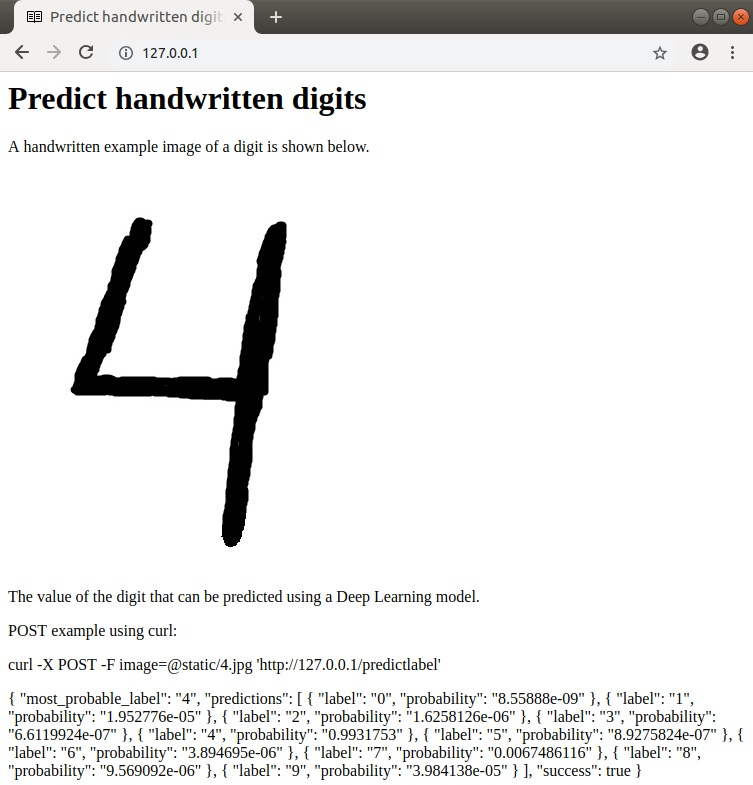

# DEEP LEARNING ON FLASK <!-- omit in toc -->

This repository stores a test to demonstrate skills mainly with [Python], [Keras], [Flask], [Docker], [Jupyter Notebook], [microservices] and [REST API].

* [PURPOSE](#purpose)
* [DEPENDENCIES](#dependencies)
  * [PYTHON VIRTUAL ENVIRONMENT](#python-virtual-environment)
* [REPOSITORY CONTENT](#repository-content)
* [ARCHITECTURE](#architecture)
* [HOW TO RUN DEEPLEARNING ON FLASK WITH DOCKER COMPOSE](#how-to-run-deeplearning-on-flask-with-docker-compose)
* [TEST SERVER & REST API](#test-server--rest-api)

## PURPOSE

The goal is to deploy on [Flask] a [deep learning] model as a microservice. The model is used to predict handwritten digits and it has been previously trained on a [Jupyter Notebook]. [REST API] are utilized to communicate with the deployed model. e.g. send image to be analized and return the generated predictions to the client.

## DEPENDENCIES

The code has been tested using:

* [Python] (3.6.7): an interpreted high-level programming language for general-purpose programming.
* [Flask] (1.0.2): a microframework for [Python] based on Werkzeug, Jinja 2 and good intentions.
* [Gunicorn] (19.9.0): a [Python] [WSGI] HTTP Server for UNIX.
* [NGINX] (1.15.7): a free, open-source, high-performance HTTP server, reverse proxy, and IMAP/POP3 proxy server.
* [Docker] (18.09.0-ce): an open platform for developers and sysadmins to build, ship, and run distributed applications, whether on laptops, data center VMs, or the cloud.
* [Docker-Compose] (1.23.1): a tool for defining and running multi-container [Docker] applications.
* [Keras] (2.2.4): a high-level neural networks [API], written in [Python] and capable of running on top of [TensorFlow], CNTK, or Theano.
* [Tensorflow] (1.12.0): an open source software [Deep Learning] library for high performance numerical computation using data flow graphs.
* [Matplotlib] (2.2.3): a plotting library for [Python] and its numerical mathematics extension [NumPy].
* [NumPy] (1.14.6): a library for [Python], adding support for large, multi-dimensional arrays and matrices, along with a large collection of high-level mathematical functions to operate on these arrays.
* [Conda] (4.5.11): a package and virtual environment manager included in [Python] Data Science Platform [Anaconda].

### PYTHON VIRTUAL ENVIRONMENT

Virtual environment (<env_name>=**dlflask36**) can be generated from **dlflask36.yaml**, **requirements.txt** files located in the repository.

Command to configure virtual environment with [Conda]:

```bash
~/deeplearning_flask$ conda env create -f dlflask36.yaml
~/deeplearning_flask$ source activate dlflask36
(dlflask36)~/deeplearning_flask$
```

## REPOSITORY CONTENT

Codetest main folder contains:

```bash
deeplearning_flask
├── Deep Learning MNIST prediction model with Keras.ipynb
├── dlflask36.yaml
├── docker-compose.yml
├── Dockerfile
├── mnist_model.h5
├── nginx
│   └── conf.d
│       └── local.conf
├── README.md
├── requirements.txt
├── server.py
├── static
│   ├── 4.jpg
│   └── index.jpg
└── templates
    └── index.html
```

## ARCHITECTURE

The architecture created with [docker-compose] uses two different [Docker] containers for:

* [NGINX].
* [Flask] and [Gunicorn].

The following diagram illustrates the architecture in blocks:

```bash
            _______            __________________
           |       |          |                  |
Client <──>| NGINX ├<─bridge─>| Flask + Gunicorn |
           |       |          |                  |
            ¯¯¯¯¯¯¯            ¯¯¯¯¯¯¯¯¯¯¯¯¯¯¯¯¯¯
```

## HOW TO RUN DEEPLEARNING ON FLASK WITH DOCKER COMPOSE

The steps and commands to run the [deep learning] model on the [Flask] server with [docker-compose] are described below.

Then [docker-compose] can be executed to build services.

```bash
~/deeplearning_flask$ docker-compose build
```

Next step consists in executing [docker-compose] up command.

```bash
~/deeplearning_flask$ docker-compose up
```

If everything goes fine at the end it should appear something similar to:

```bash
...
...
api_1_9b6c64fc338e | Using TensorFlow backend.
```

## TEST SERVER & REST API

There are different ways to check that the server is running properly. One is opening a web browser such as Chrome or Mozilla and paste the following URL:

```bash
http://127.0.0.1/
```

The web browser should show something similar to:



[REST API] can be tested with [curl] or [requests].

POST example using [curl]:

```bash
~/deeplearning_flask$ curl -X POST -F image=@static/4.jpg 'http://127.0.0.1/predictlabel'
{
  "most_probable_label": "4",
  "predictions": [
    {
      "label": "0",
      "probability": "5.870073e-09"
    },
    {
      "label": "1",
      "probability": "1.0881397e-06"
    },
    {
      "label": "2",
      "probability": "9.185746e-06"
    },
    {
      "label": "3",
      "probability": "2.4672235e-07"
    },
    {
      "label": "4",
      "probability": "0.9999093"
    },
    {
      "label": "5",
      "probability": "2.981036e-07"
    },
    {
      "label": "6",
      "probability": "8.1526576e-07"
    },
    {
      "label": "7",
      "probability": "2.3985052e-05"
    },
    {
      "label": "8",
      "probability": "3.9896346e-05"
    },
    {
      "label": "9",
      "probability": "1.5145803e-05"
    }
  ],
  "success": true
}
```

[Python]: https://www.python.org/
[Flask]: http://flask.pocoo.org/
[Gunicorn]: https://gunicorn.org/
[WSGI]: https://en.wikipedia.org/wiki/Web_Server_Gateway_Interface
[NGINX]: https://www.nginx.com/
[Docker]: https://www.docker.com/
[microservices]: https://en.wikipedia.org/wiki/Microservices
[REST API]: https://en.wikipedia.org/wiki/Representational_state_transfer
[Docker-Compose]: https://github.com/docker/compose
[Conda]: https://conda.io/docs/index.html
[Anaconda]: https://www.anaconda.com/
[Jupyter Notebook]: http://jupyter.org/
[Deep Learning]: https://en.wikipedia.org/wiki/Deep_learning
[Keras]: https://keras.io/
[Tensorflow]: https://www.tensorflow.org/
[Matplotlib]: https://matplotlib.org/
[NumPy]: http://www.numpy.org/
[curl]: https://curl.haxx.se/
[requests]: http://docs.python-requests.org/en/master/
